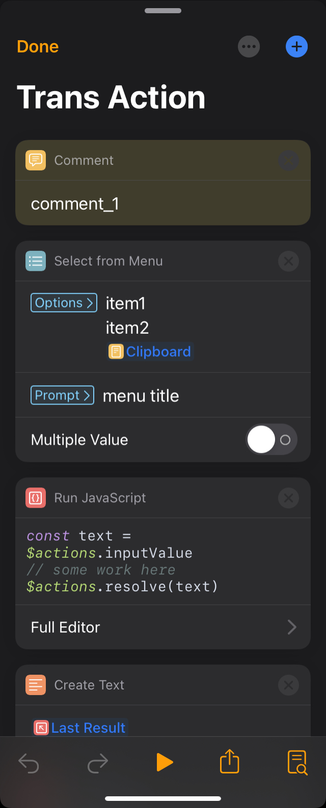

# TaioTrans

> Generate Taio's workflow with JS/TS


## Installation

```shell
npm i taiotrans@beta
```

## Usage

-   Generate action's JSON file

    ```javascript
    const TaioAction = require('taiotrans').TaioAction

    const action = new TaioAction()
    action.name = 'Trans Action'
    action.iconColor = '#e65d5b'

    action.comment('comment_1')
    action.selectMenu(
        ['item1', 'item2', action.builtInVars('Clipboard')],
        false,
        'menu title'
    )
    action.runJavaScript(() => {
        const text = $actions.inputValue
        // some work here
        $actions.resolve(text)
    })
    action.createText() // default value: action.builtInVars('Last Result')
    action.repeatBlock(5, (action) => {
        const val = action.setVariable('some value')
        action.getVariable(val)
        action.createText(`value of variable: ${val}`)
        action.comment('comment_2')
    })

    const fs = require('fs')
    fs.writeFileSync('output.json', JSON.stringify(action.flowParse(), null, 2))
    ```

-   Import JSON file to Taio
    <div style="text-align:center"></div>
    <!--  -->

## License

MIT © MamoruDS
